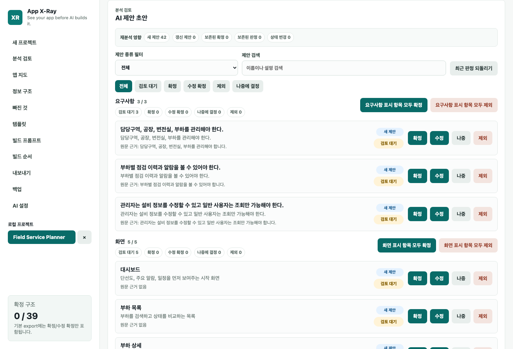
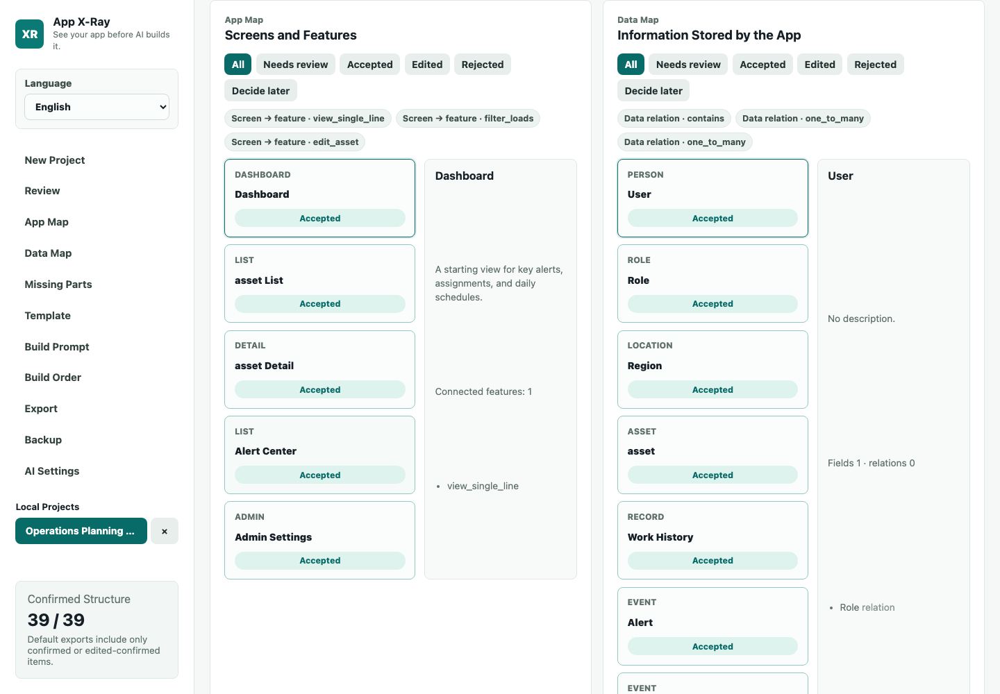
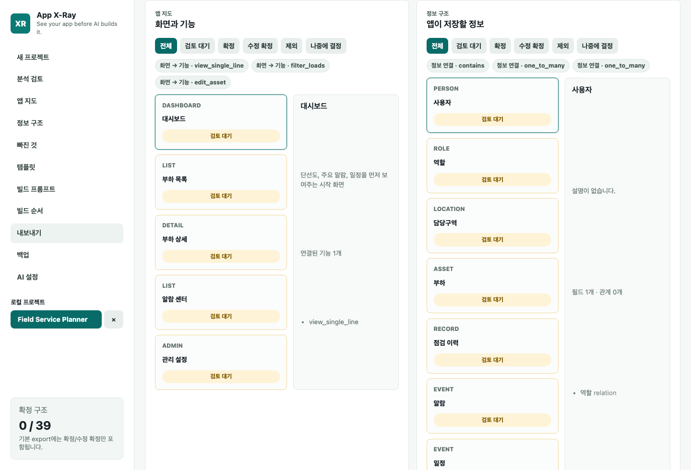
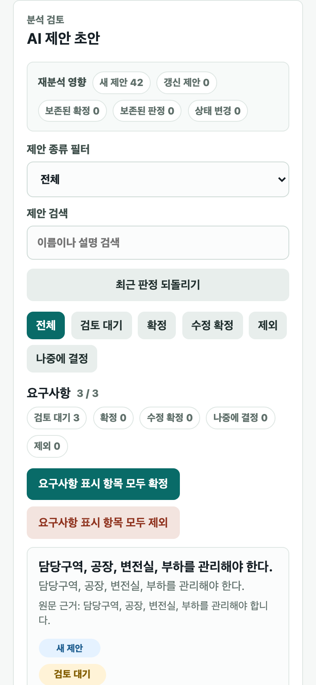

# App X-Ray

> See your app before AI builds it.

[한국어](README.ko.md)

App X-Ray is a local-first, open-source planning tool for people who want to turn app ideas, PRDs, and working notes into a reviewable app structure before sending anything to an AI coding tool.

It does not generate code or modify your target repository. Instead, it helps you review the product shape first: screens, data objects, permissions, missing decisions, user flows, build prompts, and exports for tools such as Codex, Cursor, Lovable, Replit, and Bolt.

## Why It Exists

AI coding works best when the app structure is clear. Many users know their domain well but still struggle to translate that knowledge into screens, data models, permissions, and workflows.

App X-Ray gives you a structured map of the app before implementation begins, so vague prompts do not turn into vague software.

## Screenshots

### Review Workbench



### App Map



### Export Readiness



### Mobile Review



## Core Principle

```text
AI suggests.
The user confirms.
The system preserves.
```

AI output starts as a draft. Only user-confirmed `accepted` and `edited` structure is included in the default export.

## What App X-Ray Does

- Converts ideas, PRDs, notes, Markdown, TXT, CSV, and JSON into a structured app map.
- Shows reviewable AI suggestions for screens, features, data objects, fields, relations, roles, permissions, flows, and missing decisions.
- Lets users accept, edit, reject, defer, bulk review, and undo review decisions.
- Preserves confirmed user decisions across AI re-analysis and recovery flows.
- Validates export readiness and points users to affected review rows.
- Exports Markdown, Mermaid diagrams, JSON, CSV, Codex/Cursor prompts, GitHub issue drafts, and bundle JSON.
- Stores projects locally in the browser and supports workspace backup and restore.
- Runs in Korean or English through the in-app language selector.
- Can be packaged as a local Electron desktop app for easier everyday use.
- Supports deterministic mock analysis and BYOK provider settings for OpenAI, Anthropic, Google Gemini, and OpenRouter.

## Product Boundary

App X-Ray is intentionally local-first.

- Project data is stored in browser `localStorage` and user-downloaded workspace backups.
- There is no hidden SaaS backend, hosted workspace, login, billing, marketplace, or token resale.
- AI API keys are stored only in browser-local settings.
- API keys must not appear in exports, prompts, backups, fixtures, logs, or tests.
- Browser BYOK calls may be blocked by provider CORS policy. Mock mode remains the safe offline fallback.
- App X-Ray is a planning and review tool. It does not replace AI coding tools; it prepares better input for them.

See also:

- [Service readiness](docs/product/service-readiness.md)
- [Local-first data contract](docs/product/local-first-data-contract.md)
- [Desktop packaging decision](docs/product/desktop-packaging-decision.md)
- [Manual QA checklist](docs/product/manual-qa-checklist.md)

## Supported Imports

| Input | Status | Notes |
|---|---:|---|
| Pasted text | Supported | PRDs, app ideas, and work notes are stored as source text. |
| `.md` | Supported | Imported as Markdown source text. |
| `.markdown` | Supported | Imported as Markdown source text. |
| `.txt` | Supported | Imported as plain text. |
| `.csv` | Supported | Headers are detected and converted into structured source text. |
| `.json` | Supported | Valid JSON is pretty-printed into source text. |
| `.pdf` | Not supported | PDF parsing is intentionally deferred until a parser dependency is approved. |

## Supported Exports

Default exports use confirmed data only: `accepted` and `edited`. `suggested`, `rejected`, and `deferred` records are included only in explicit audit trail mode.

| Export | Example file | Purpose |
|---|---|---|
| Markdown | `app-xray-project.md` | Human-readable app structure |
| App Map Mermaid | `app-xray-project-app-map.mmd` | Screen relationship diagram |
| Data Map Mermaid | `app-xray-project-data-map.mmd` | Data relationship diagram |
| JSON | `app-xray-project.json` | Confirmed structured data |
| Data Objects CSV | `app-xray-project-data-objects.csv` | Spreadsheet-friendly confirmed data objects |
| Issues CSV | `app-xray-project-issues.csv` | Spreadsheet-friendly confirmed missing decisions |
| Codex Prompt | `app-xray-project-codex.md` | Build prompt for Codex |
| Cursor Prompt | `app-xray-project-cursor.md` | Build prompt for Cursor |
| GitHub Issues Markdown | `app-xray-project-github-issues.md` | Draft implementation issues |
| Bundle JSON | `app-xray-project-bundle.json` | A single bundle containing export artifacts |
| Workspace Backup | `app-xray-workspace-project.json` | Local workspace transfer and recovery |

## Core Workflow

```text
Idea / PRD / notes
-> App X-Ray analysis
-> Review suggested structure
-> Accept / edit / reject / defer
-> Check App Map, Data Map, and Missing Parts
-> Export confirmed structure and build prompts
-> Send the result to Codex, Cursor, Lovable, Replit, or Bolt
```

## Development

### Prerequisites

- Node.js 20+
- npm

### Install and Run the Web App

```bash
npm install
npm run dev
```

The Vite dev server binds to `127.0.0.1` by default.

### Desktop App

App X-Ray can also run as a local Electron desktop app. The desktop shell loads the same local-first React app and keeps the renderer isolated with Electron's `contextIsolation`, disabled Node integration, and a minimal preload bridge.

```bash
npm run electron:dev
```

To create a packaged macOS desktop build:

```bash
npm run package:dir
npm run package:mac
```

Generated desktop packages are written to `release/`:

- `release/mac-arm64/App X-Ray.app`: unpacked local test build
- `release/App X-Ray-0.0.0-arm64.dmg`: macOS installer image
- `release/App X-Ray-0.0.0-arm64-mac.zip`: zipped macOS app

macOS builds are currently unsigned by default, so local Gatekeeper policy may require opening the app manually from Finder the first time.

### Quality Checks

```bash
npm run typecheck
npm test
npm run build
npm run test:e2e
```

Generated outputs:

- `dist/`: TypeScript compile output
- `app-dist/`: Vite production build output
- `release/`: Electron desktop package output
- `test-results/`: Playwright test output
- `playwright-report/`: Playwright HTML report

## Repository Structure

```text
src/
  ai/            AI adapter, BYOK provider, and structured prompt logic
  app/           App-level workflows extracted from the React shell
  components/    Review, map, and export UI
  domain/        Core App X-Ray data model, lifecycle, validation, routing
  export/        Markdown, Mermaid, JSON, CSV, prompt, and bundle exports
  i18n.ts        Korean and English UI labels
  storage/       Local project repository, backups, autosave snapshots
electron/
  main.cjs       Secure Electron main process
  preload.cjs    Minimal isolated preload bridge
test/
  e2e/           Playwright browser flows
  *.test.mjs     Node test runner coverage for domain, UI, storage, AI, export
docs/product/    Product boundary, service readiness, QA, and packaging notes
app-xray-codex-rules/
  Product and engineering rules used while building App X-Ray
```

## Contributing

Read [CONTRIBUTING.md](CONTRIBUTING.md) before opening a pull request.

Short version:

- Keep changes local-first.
- Preserve confirmed user decisions.
- Keep API keys out of exports, prompts, backups, fixtures, logs, and tests.
- Keep default exports confirmed-only.
- Run the relevant checks and report anything that was not run.

## Security

Do not open public issues for suspected vulnerabilities. See [SECURITY.md](SECURITY.md).

## License

MIT. See [LICENSE](LICENSE).
