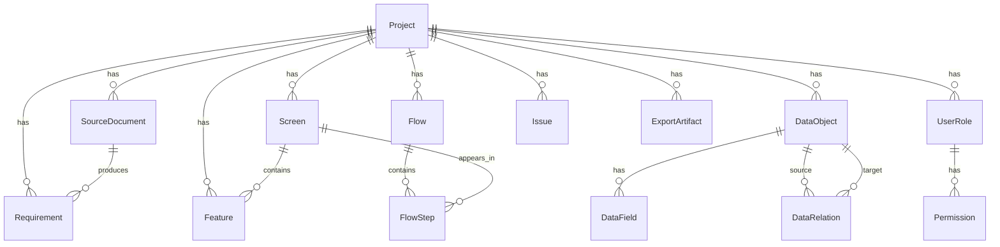

# Domain Model

## Core Concept

App X-Ray turns unstructured source documents into structured product maps.

The domain model separates:

1. Source input
2. AI suggestions
3. User-confirmed structure
4. Exports
5. Templates

## Entity Overview



## Shared Fields

Most AI-derived records should include:

```ts
type SuggestionStatus =
  | "suggested"
  | "accepted"
  | "edited"
  | "rejected"
  | "deferred";

type ConfidenceBand =
  | "likely"
  | "review"
  | "weak";

type SourceTrace = {
  sourceDocumentId?: string;
  quote?: string;
  sectionTitle?: string;
  startOffset?: number;
  endOffset?: number;
};

type BaseXrayObject = {
  id: string;
  projectId: string;
  status: SuggestionStatus;
  confidence?: number;
  confidenceBand?: ConfidenceBand;
  sourceTrace?: SourceTrace;
  createdAt: string;
  updatedAt: string;
};
```

## Project

A project is one app idea or product mapping workspace.

```ts
type Project = {
  id: string;
  name: string;
  description?: string;
  appTypes: string[];
  createdAt: string;
  updatedAt: string;
};
```

## SourceDocument

A source document is the original user input.

```ts
type SourceDocument = {
  id: string;
  projectId: string;
  title: string;
  content: string;
  sourceType: "text" | "markdown" | "txt" | "pdf" | "imported";
  version: number;
  createdAt: string;
};
```

## Requirement

A requirement is an extracted statement from source input.

```ts
type Requirement = BaseXrayObject & {
  sourceDocumentId: string;
  text: string;
  requirementType:
    | "screen"
    | "feature"
    | "data"
    | "permission"
    | "flow"
    | "non_functional"
    | "business_rule"
    | "unknown";
  priority?: "low" | "medium" | "high";
};
```

## Screen

A screen is a visible page, view, panel, modal, or app area.

```ts
type Screen = BaseXrayObject & {
  name: string;
  displayName?: string;
  description?: string;
  screenType:
    | "dashboard"
    | "list"
    | "detail"
    | "form"
    | "settings"
    | "admin"
    | "report"
    | "canvas"
    | "modal"
    | "unknown";
  parentScreenId?: string;
  orderIndex?: number;
};
```

## Feature

A feature is a user action or capability.

```ts
type Feature = BaseXrayObject & {
  screenId?: string;
  name: string;
  description?: string;
  actionType:
    | "create"
    | "read"
    | "update"
    | "delete"
    | "search"
    | "filter"
    | "import"
    | "export"
    | "notify"
    | "approve"
    | "visualize"
    | "unknown";
};
```

## DataObject

A data object is something the app must remember.

UI copy should call this "앱이 저장할 정보".

```ts
type DataObject = BaseXrayObject & {
  name: string;
  displayName?: string;
  description?: string;
  objectType:
    | "person"
    | "role"
    | "asset"
    | "location"
    | "event"
    | "record"
    | "file"
    | "transaction"
    | "setting"
    | "unknown";
};
```

## DataField

A field belongs to a data object.

```ts
type DataField = BaseXrayObject & {
  dataObjectId: string;
  name: string;
  displayName?: string;
  fieldType:
    | "text"
    | "number"
    | "boolean"
    | "date"
    | "datetime"
    | "enum"
    | "relation"
    | "file"
    | "json"
    | "unknown";
  required?: boolean;
  enumValues?: string[];
  description?: string;
};
```

## DataRelation

A relation connects two data objects.

```ts
type DataRelation = BaseXrayObject & {
  sourceObjectId: string;
  targetObjectId: string;
  relationType:
    | "one_to_one"
    | "one_to_many"
    | "many_to_one"
    | "many_to_many"
    | "contains"
    | "references"
    | "owns"
    | "creates"
    | "unknown";
  description?: string;
};
```

## UserRole

A role describes a user type.

```ts
type UserRole = BaseXrayObject & {
  name: string;
  displayName?: string;
  description?: string;
};
```

## Permission

A permission defines what a role can do.

```ts
type Permission = BaseXrayObject & {
  roleId: string;
  targetType: "screen" | "feature" | "dataObject" | "project";
  targetId?: string;
  action:
    | "view"
    | "create"
    | "edit"
    | "delete"
    | "export"
    | "approve"
    | "manage";
  allowed: boolean;
};
```

## Flow

A flow is a main user journey.

```ts
type Flow = BaseXrayObject & {
  name: string;
  description?: string;
  primaryRoleId?: string;
};
```

## FlowStep

A step belongs to a flow.

```ts
type FlowStep = BaseXrayObject & {
  flowId: string;
  stepOrder: number;
  screenId?: string;
  actionDescription: string;
  dataObjectId?: string;
  featureId?: string;
};
```

## Issue

An issue is a missing, ambiguous, conflicting, or risky part.

UI copy should call this "빠진 것" or "결정 필요".

```ts
type Issue = BaseXrayObject & {
  issueType:
    | "missing"
    | "ambiguous"
    | "conflict"
    | "data_gap"
    | "permission_gap"
    | "state_gap"
    | "exception_gap"
    | "scope_risk";
  severity: "low" | "medium" | "high";
  title: string;
  description: string;
  suggestion?: string;
  relatedScreenId?: string;
  relatedDataObjectId?: string;
  relatedFeatureId?: string;
};
```

## ExportArtifact

An exported artifact.

```ts
type ExportArtifact = {
  id: string;
  projectId: string;
  artifactType:
    | "markdown"
    | "mermaid"
    | "json"
    | "codex_prompt"
    | "cursor_prompt"
    | "lovable_prompt"
    | "replit_prompt"
    | "github_issues_markdown";
  content: string;
  createdAt: string;
};
```

## Canonical Export Rule

By default, export only records where:

```ts
status === "accepted" || status === "edited"
```

Allow optional export modes:

- confirmed only
- include suggested
- include rejected for audit
