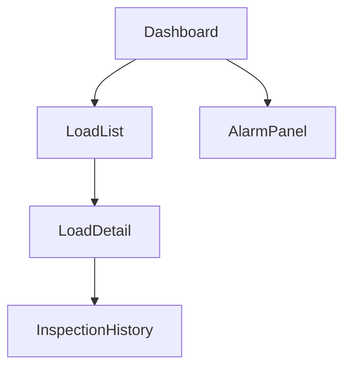
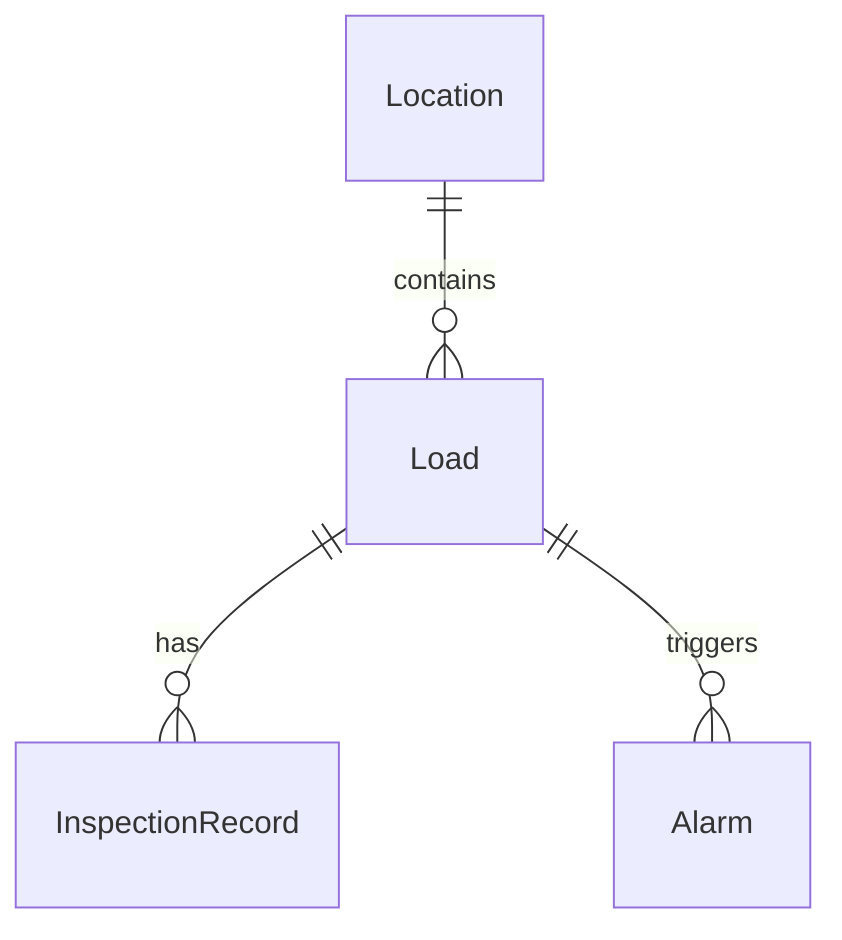

# Export Rules

## Core Rule

Exports must be generated from confirmed structured data.

Do not export raw AI output as the final source of truth.

Default export includes records with:

- `accepted`
- `edited`

Optional modes may include:

- suggested
- deferred
- rejected audit trail

## Supported Export Types

Initial export types:

1. Markdown
2. Mermaid
3. JSON
4. AI build prompt
5. GitHub issue markdown

Future export types:

- PDF
- Notion
- Linear
- Jira
- Supabase schema
- Figma structure

## Markdown Export

Markdown export should include:

1. Project Summary
2. App Type
3. App Map
4. Data Map
5. Flow Map
6. Missing Parts
7. Roles and Permissions
8. Build Plan
9. AI Build Prompts
10. Appendix: Source Notes

Recommended filename:

```text
app-xray-[project-slug].md
```

## Mermaid Export

Mermaid export should be generated from stored nodes and edges.

Do not ask AI to write Mermaid if graph data already exists.

### App Map Example



### Data Map Example



## JSON Export

JSON export should preserve the canonical structured data.

Recommended top-level shape:

```json
{
  "schemaVersion": "1.0.0",
  "project": {},
  "screens": [],
  "features": [],
  "dataObjects": [],
  "dataRelations": [],
  "roles": [],
  "permissions": [],
  "flows": [],
  "issues": [],
  "buildPlan": []
}
```

## AI Build Prompt Export

Prompt export should be generated in two phases:

1. Logic assembles structured prompt context.
2. AI rewrites it for the selected target tool.

Prompt context must include:

- project goal
- app type
- target user
- selected screens
- selected data objects
- selected flows
- selected issues
- included scope
- excluded scope
- completion criteria

## Prompt Must Include Excluded Scope

Every generated build prompt must explicitly say what not to build.

Example:

```text
이번 단계에서 제외할 것:
- 실제 로그인
- 결제
- 파일 업로드
- 실시간 알림
- 외부 API 연동
```

## GitHub Issue Markdown

Each issue should include:

- title
- context
- task list
- acceptance criteria
- related screens/data
- excluded scope if relevant

Example:

```markdown
## Build Load Detail screen

### Context
The app needs a detail screen for each Load.

### Tasks
- [ ] Create route for Load Detail
- [ ] Show basic Load fields
- [ ] Add Inspection History section
- [ ] Add empty state

### Acceptance Criteria
- [ ] User can open a Load from Load List
- [ ] Selected Load data is displayed
- [ ] Missing Load ID shows a friendly empty state
```

## Export Validation

Before exporting:

1. Check for broken references.
2. Check for duplicate names where invalid.
3. Warn if high-severity issues remain open.
4. Warn if no data objects exist.
5. Warn if no screens exist.
6. Warn if prompt includes rejected items.
7. Warn if selected build step has no completion criteria.

## Deterministic Output

Markdown and Mermaid should be deterministic.

Same project state should produce same export output.

This helps with Git diffs and review.
